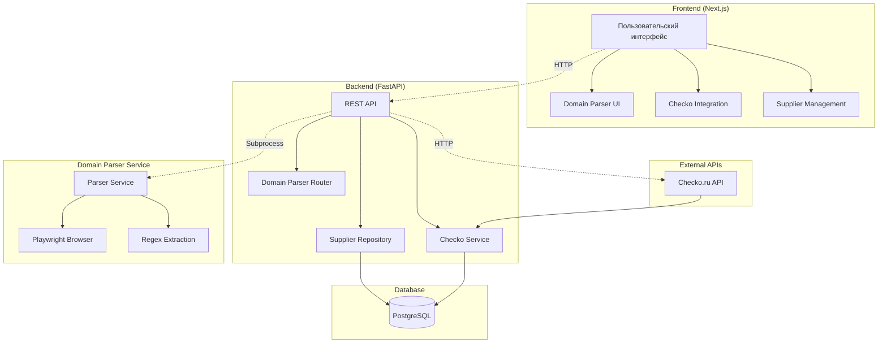

# 🏢 B2B Platform

**Система для автоматизации поиска, парсинга и модерации поставщиков с интеграцией Checko API и Domain Parser.**

## 🎯 Ключевые возможности

### 🔍 **Domain Parser** - Автоматическое извлечение ИНН и Email
- ✅ **Автосохранение доменов** с ИНН+Email после парсинга
- ✅ **Загрузка данных из Checko** для каждого нового поставщика  
- ✅ **Защита от дубликатов** через проверку по домену
- ✅ **Интеграция с UI** - кнопка "Получить данные" в интерфейсе

### 📋 **Checko Integration** - Полные данные о компаниях
- ✅ **API интеграция** с Checko.ru для получения полной информации
- ✅ **Кэширование** данных на 24 часа
- ✅ **Прямые ссылки** на компании из карточек поставщиков
- ✅ **Автозаполнение** форм данными из Checko

### 🏗️ **Модерация поставщиков**
- ✅ **CRUD операции** для управления поставщиками
- ✅ **Фильтрация** по типу (поставщик/реселлер)
- ✅ **Поиск и сортировка** по всем полям
- ✅ **Валидация данных** с ограничениями БД

---

## 📚 Документация

**⚠️ ВАЖНО: Перед началом работы изучи документацию!**

- **📖 Главная инструкция**: [`docs/MASTER_INSTRUCTION.md`](docs/MASTER_INSTRUCTION.md) - **НАЧНИ ОТСЮДА!**
- **🔧 Новые функции**: [`NEW_FEATURES_DOCUMENTATION.md`](NEW_FEATURES_DOCUMENTATION.md) - автосохранение, Checko, защита от дубликатов
- **🐛 Библия ошибок**: [`docs/TROUBLESHOOTING.md`](docs/TROUBLESHOOTING.md) - все ошибки и решения
- **🎯 Критические точки**: [`docs/CRITICAL_INTEGRATIONS_AND_CHECKLISTS.md`](docs/CRITICAL_INTEGRATIONS_AND_CHECKLISTS.md)
- **📋 Спецификация API**: [`docs/PROJECT_SPECIFICATION.md`](docs/PROJECT_SPECIFICATION.md)
- **🗺️ Карта проекта**: [`docs/PROJECT_MAP.md`](docs/PROJECT_MAP.md)

**🚀 Новое в v2.0:**
- Автосохранение доменов с ИНН+Email
- Интеграция с Checko API
- Защита от дубликатов поставщиков
- Улучшенный UI с индикаторами статуса

**При возникновении ошибки:**
1. СНАЧАЛА проверь [`docs/TROUBLESHOOTING.md`](docs/TROUBLESHOOTING.md)
2. Если решения нет - реши и ОБЯЗАТЕЛЬНО задокументируй

---

## 🏗️ Архитектура системы



---

## 🚀 Быстрый старт

### 1️⃣ **Запуск всех сервисов (один клик):**

```batch
start-all-tabby.bat
```

### 2️⃣ **Откройте интерфейс:**
- **Frontend:** http://localhost:3000
- **Backend API:** http://127.0.0.1:8000/docs

### 3️⃣ **Используйте новые функции:**

#### **🔍 Domain Parser:**
1. Перейдите в раздел "Parsing Runs"
2. Выделите домены для анализа
3. Нажмите **"Получить данные"**
4. Дождитесь завершения (индикаторы 🔄→✅)
5. Домены с ИНН+Email автоматически сохранятся как поставщики

#### **📋 Checko Integration:**
1. Создайте/редактируйте поставщика
2. Введите ИНН компании
3. Нажмите **"Заполнить Данные"** - загрузка из Checko
4. Нажмите **"Checko"** - переход на страницу компании

#### **🛡️ Защита от дубликатов:**
- Автоматическая проверка существования по домену
- UNIQUE constraint в базе данных
- Уведомления о пропущенных дубликатах

**📖 Подробная документация:** [`docs/MASTER_INSTRUCTION.md`](docs/MASTER_INSTRUCTION.md) - раздел "3. Быстрый старт"

## 🏗️ Структура проекта

```
tryagain/
├── backend/                           # Backend сервис (FastAPI)
│   ├── app/
│   │   ├── transport/
│   │   │   ├── routers/
│   │   │   │   ├── domain_parser.py     # Domain Parser API
│   │   │   │   ├── moderator_suppliers.py # Поставщики
│   │   │   │   └── checko.py             # Checko API
│   │   │   └── schemas/
│   │   ├── usecases/
│   │   │   ├── get_checko_data.py       # Checko интеграция
│   │   │   └── create_moderator_supplier.py # Создание поставщиков
│   │   └── adapters/db/
│   │       ├── models.py                # SQLAlchemy модели
│   │       └── repositories.py          # Repository паттерн
│   └── main.py                          # FastAPI приложение
├── frontend/
│   └── moderator-dashboard-ui/           # Next.js Frontend
│       ├── app/
│       │   └── parsing-runs/[runId]/
│       │       └── page.tsx              # UI Domain Parser
│       ├── lib/
│       │   ├── api.ts                    # API функции
│       │   └── types.ts                  # TypeScript типы
│       └── components/
│           ├── checko-info-dialog.tsx    # Checko диалог
│           └── supplier-card.tsx         # Карточка поставщика
├── domain_info_parser/                   # 🆕 Domain Parser
│   ├── parser.py                         # Основной парсер
│   ├── run_parser.py                     # Скрипт запуска
│   ├── test_parser.py                    # Тесты
│   └── requirements.txt                   # Зависимости
├── docs/                                # Документация
│   ├── MASTER_INSTRUCTION.md            # Главная инструкция
│   ├── TROUBLESHOOTING.md                # Ошибки и решения
│   └── PROJECT_MAP.md                    # Карта проекта
├── NEW_FEATURES_DOCUMENTATION.md        # 🆕 Новые функции v2.0
├── DOMAIN_PARSER_DOCUMENTATION.md        # 🆕 Документация Domain Parser
├── remove_duplicates.sql                 # 🆕 Скрипт удаления дубликатов
└── remove_duplicates.py                  # 🆕 Скрипт очистки БД
```

---

## 🔧 Технологический стек

### **Frontend:**
- **Next.js 16** (App Router) - React фреймворк
- **TypeScript** - типизация
- **Tailwind CSS** - стилизация
- **Shadcn/ui** - UI компоненты
- **React Query** - управление состоянием

### **Backend:**
- **FastAPI** - Python веб-фреймворк
- **SQLAlchemy 2.0** - ORM
- **PostgreSQL 15** - база данных
- **Pydantic** - валидация данных
- **AsyncPG** - асинхронный драйвер PostgreSQL

### **Domain Parser:**
- **Playwright** - автоматизация браузера
- **Python asyncio** - асинхронность
- **Regex** - извлечение данных
- **Chrome CDP** - отладка браузера

### **Интеграции:**
- **Checko.ru API** - данные о компаниях
- **PostgreSQL** - хранение данных
- **Redis** (опционально) - кэширование

---

## 🌐 Порты и сервисы

| Сервис | Порт | URL | Описание |
|--------|------|-----|----------|
| **Frontend** | `3000` | http://localhost:3000 | Next.js приложение |
| **Backend** | `8000` | http://127.0.0.1:8000 | FastAPI API |
| **Parser Service** | `9003` | http://127.0.0.1:9003 | Domain Parser |
| **Chrome CDP** | `9222` | http://127.0.0.1:9222 | Chrome DevTools |
| **PostgreSQL** | `5432` | localhost:5432 | База данных |

---

## 🧪 Разработка

### **Backend тесты:**
```powershell
cd backend
pytest -v
```

### **Frontend линтинг:**
```powershell
cd frontend/moderator-dashboard-ui
npm run lint
npm run type-check
```

### **Domain Parser тесты:**
```powershell
cd domain_info_parser
python test_parser.py
```

### **Проверка импортов:**
```powershell
python temp/backend/check_imports.py
```

---

## 📦 Установка и развертывание

### **Требования:**
- **Python 3.12+**
- **Node.js 18+**
- **PostgreSQL 15+**
- **Playwright браузеры**

### **Установка зависимостей:**
```bash
# Backend
cd backend
pip install -r requirements.txt

# Frontend  
cd frontend/moderator-dashboard-ui
npm install

# Domain Parser
cd domain_info_parser
pip install -r requirements.txt
playwright install chromium
```

---

## 🚀 Версии и релизы

### **v2.0 (Текущая) - 10.01.2026**
- ✅ Domain Parser с автосохранением
- ✅ Checko API интеграция
- ✅ Защита от дубликатов
- ✅ Улучшенный UI с индикаторами

### **v1.0 - Базовая версия**
- ✅ CRUD поставщиков
- ✅ Comet парсер
- ✅ Базовая модерация

---

**📖 Подробная документация:** [`docs/MASTER_INSTRUCTION.md`](docs/MASTER_INSTRUCTION.md)

---

**📄 Лицензия:** MIT License

---

**👥 Авторы:** B2B Platform Development Team

---

**⭐ Если проект полезен - поставьте звезду на GitHub!**
