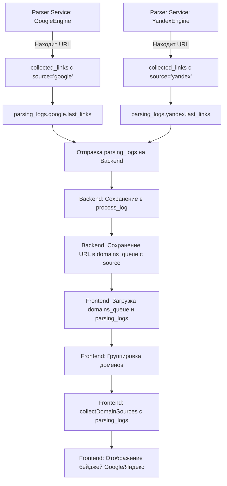

# Поток данных: Определение источников для доменов (Google/Яндекс)

**Статус:** ✅ Проверено и работает  
**Дата создания:** 2025-12-29  
**Последнее обновление:** 2025-12-29

## Обзор

Документ описывает полный поток данных от парсера до отображения бейджей источников (Google/Яндекс) для доменов на фронтенде. Это критически важная функциональность, которая используется в нескольких местах интерфейса.

## Проблема, которую решает

В базе данных все URL сохраняются с `source="both"`, даже если они были найдены только одним поисковиком. Это происходит потому, что парсер определяет источник на основе того, кто нашел URL, но при сохранении в БД все URL получают `source="both"` если оба поисковика работают.

**Решение:** Использовать `parsing_logs` (логи парсинга) для точного определения источников, так как они содержат реальную информацию о том, какой поисковик нашел каждый URL.

## Полный поток данных

### Этап 1: Parser Service - Сбор URL и определение источников

**Файлы:**
- `parser_service/src/engines.py` - классы `GoogleEngine` и `YandexEngine`
- `parser_service/src/parser.py` - основной класс `Parser`

**Процесс:**

1. **Сбор URL из поисковых результатов:**
   - `GoogleEngine` парсит результаты Google и добавляет найденные URL в `collected_links` с меткой `"google"`
   - `YandexEngine` парсит результаты Yandex и добавляет найденные URL в `collected_links` с меткой `"yandex"`
   - Если один и тот же URL найден обоими поисковиками, он имеет оба источника в `collected_links[url] = {"google", "yandex"}`

2. **Обновление parsing_logs:**
   - При нахождении каждой ссылки обновляется словарь `parsing_logs`:
     ```python
     parsing_logs = {
         "google": {
             "total_links": 8,  # Общее количество уникальных ссылок
             "pages_processed": 1,
             "links_by_page": {1: 16},  # Количество ссылок по страницам
             "last_links": [...]  # Последние 20 найденных ссылок
         },
         "yandex": {
             "total_links": 10,
             "pages_processed": 1,
             "links_by_page": {1: 20},
             "last_links": [...]
         }
     }
     ```
   - `last_links` содержит последние 20 найденных ссылок для каждого поисковика
   - Это ключевая информация для определения источников на фронтенде

3. **Определение source для каждого URL:**
   ```python
   # В parser.py или api.py
   for url, sources in collected_links.items():
       # Если URL найден обоими поисковиками
       url_source = "both" if len(sources) > 1 else list(sources)[0] if sources else "google"
   ```

**Код:**
```python
# parser_service/src/engines.py
# GoogleEngine
collected_links[clean_href].add("google")
google_logs["last_links"].append(clean_href)

# YandexEngine
collected_links[clean_url].add("yandex")
yandex_logs["last_links"].append(clean_url)
```

### Этап 2: Backend - Сохранение в БД с source

**Файлы:**
- `backend/app/usecases/start_parsing.py` - сохранение результатов парсинга

**Процесс:**

1. **Получение результатов от Parser Service:**
   - Parser Service возвращает список `suppliers` с полем `source` для каждого URL
   - Также возвращается `parsing_logs` с информацией о найденных ссылках

2. **Сохранение в domains_queue:**
   ```python
   await domain_queue_repo.create({
       "domain": domain,
       "keyword": keyword,
       "url": supplier['source_url'],
       "parsing_run_id": run_id,
       "source": url_source,  # "google", "yandex", или "both"
       "status": "pending"
   })
   ```

3. **Сохранение parsing_logs:**
   - `parsing_logs` сохраняются в `process_log["parsing_logs"]` в таблице `parsing_runs`
   - Это происходит после завершения парсинга в `start_parsing.py`

**Код:**
```python
# backend/app/usecases/start_parsing.py
process_info = {
    "parsing_logs": parsing_logs,  # Сохраняем логи для последующего использования
    # ... другие данные
}
await run_repo.update(run_id, {"process_log": process_info})
```

### Этап 3: Backend - Отправка parsing_logs в реальном времени

**Файлы:**
- `parser_service/src/parser.py` - функция `_send_parsing_logs()`
- `parser_service/api.py` - функция `send_logs_periodically()`
- `backend/app/transport/routers/parsing_runs.py` - endpoint `update_parsing_logs_endpoint()`

**Процесс:**

1. **Отправка логов во время парсинга:**
   - Каждые 2.5 секунды Parser Service отправляет обновленные `parsing_logs` на Backend
   - Endpoint: `PUT /parsing/runs/{run_id}/logs`
   - Backend обновляет `process_log["parsing_logs"]` в БД

2. **Получение логов:**
   - Frontend может получить логи через endpoint: `GET /parsing/runs/{run_id}/logs`
   - Endpoint возвращает `parsing_logs` из `process_log`

**Код:**
```python
# parser_service/src/parser.py
async def _send_parsing_logs(self, run_id: str, parsing_logs: dict):
    async with httpx.AsyncClient() as client:
        await client.put(
            f"{BACKEND_URL}/parsing/runs/{run_id}/logs",
            json={"parsing_logs": parsing_logs}
        )
```

### Этап 4: Frontend - Загрузка данных и логов

**Файлы:**
- `frontend/moderator-dashboard-ui/app/parsing-runs/[runId]/page.tsx` - функция `loadData()`
- `frontend/moderator-dashboard-ui/lib/api.ts` - функция `getParsingLogs()`

**Процесс:**

1. **Загрузка данных:**
   ```typescript
   const [runData, domainsData, logsData] = await Promise.all([
     getParsingRun(runId),
     getDomainsQueue({ parsingRunId: runId, limit: 1000 }),
     getParsingLogs(runId).catch(() => ({ parsing_logs: {} }))
   ])
   ```

2. **Сохранение parsing_logs в state:**
   ```typescript
   if (logsData.parsing_logs && Object.keys(logsData.parsing_logs).length > 0) {
     setParsingLogs(logsData.parsing_logs)
   }
   ```

**Код:**
```typescript
// frontend/moderator-dashboard-ui/app/parsing-runs/[runId]/page.tsx
const parsingLogsForSources = logsData.parsing_logs && Object.keys(logsData.parsing_logs).length > 0 
  ? logsData.parsing_logs 
  : null
```

### Этап 5: Frontend - Группировка доменов и определение источников

**Файлы:**
- `frontend/moderator-dashboard-ui/lib/utils-domain.ts` - функция `collectDomainSources()`
- `frontend/moderator-dashboard-ui/app/parsing-runs/[runId]/page.tsx` - функция `loadData()`

**Процесс:**

1. **Группировка доменов:**
   ```typescript
   let grouped = groupByDomain(filtered).map((group) => {
     // Группируем URL по доменам
   })
   ```

2. **Определение источников для каждого домена:**
   ```typescript
   const sources = collectDomainSources(group.urls, parsingLogsForSources)
   ```

3. **Логика `collectDomainSources()`:**
   - Если передан `parsingLogs`, используется он для определения источников
   - Для каждого URL в группе:
     - Нормализуется URL (убирается протокол, www, trailing slash, параметры)
     - Проверяется наличие в `parsingLogs.google.last_links` - если есть, добавляется "google"
     - Проверяется наличие в `parsingLogs.yandex.last_links` - если есть, добавляется "yandex"
   - Собираются уникальные источники для всех URL домена
   - Если `parsingLogs` не передан, используется fallback с `source` из БД

**Код:**
```typescript
// frontend/moderator-dashboard-ui/lib/utils-domain.ts
export function collectDomainSources(
  urls: Array<{ url: string; source?: string | null }>,
  parsingLogs?: {
    google?: { last_links: string[] }
    yandex?: { last_links: string[] }
  } | null
): string[] {
  const sources = new Set<string>()
  
  if (parsingLogs) {
    for (const urlEntry of urls) {
      const normalizedUrl = normalizeUrl(urlEntry.url)
      
      // Проверяем Google
      if (parsingLogs.google?.last_links) {
        const foundInGoogle = parsingLogs.google.last_links.some(link => 
          normalizeUrl(link) === normalizedUrl
        )
        if (foundInGoogle) {
          sources.add("google")
        }
      }
      
      // Проверяем Yandex
      if (parsingLogs.yandex?.last_links) {
        const foundInYandex = parsingLogs.yandex.last_links.some(link => 
          normalizeUrl(link) === normalizedUrl
        )
        if (foundInYandex) {
          sources.add("yandex")
        }
      }
    }
  } else {
    // Fallback: используем source из базы данных
    // ...
  }
  
  return Array.from(sources).sort()
}
```

### Этап 6: Frontend - Отображение бейджей

**Файлы:**
- `frontend/moderator-dashboard-ui/app/parsing-runs/[runId]/page.tsx` - компонент отображения доменов

**Процесс:**

1. **Отображение бейджей для каждого домена:**
   ```typescript
   {group.sources && group.sources.includes("google") && (
     <Badge variant="outline" className="bg-blue-100 text-blue-700 border-blue-300 text-xs">
       Google
     </Badge>
   )}
   {group.sources && group.sources.includes("yandex") && (
     <Badge variant="outline" className="bg-yellow-100 text-yellow-700 border-yellow-300 text-xs">
       Яндекс
     </Badge>
   )}
   ```

2. **Результат:**
   - Если домен найден только Google - показывается только синий бейдж "Google"
   - Если домен найден только Яндекс - показывается только желтый бейдж "Яндекс"
   - Если домен найден обоими - показываются оба бейджа

## Диаграмма потока данных



## Нормализация URL

**Функция:** `normalizeUrl()` в `frontend/moderator-dashboard-ui/lib/utils-domain.ts`

**Процесс нормализации:**
1. Убирается протокол (`http://`, `https://`)
2. Убирается `www.`
3. Убирается trailing slash (`/`)
4. Убираются параметры (все после `#` или `?`)
5. Приводится к нижнему регистру

**Примеры:**
```
https://example.com/page/ → example.com/page
https://www.example.com/page?param=value → example.com/page
http://Example.com/page#anchor → example.com/page
```

**Важность:** Нормализация необходима для корректного сравнения URL из разных источников, так как один и тот же URL может быть представлен по-разному (с/без протокола, с/без www, с/без параметров).

## Примеры работы функции collectDomainSources

### Пример 1: Домен найден только Google

**Входные данные:**
```typescript
urls = [
  { url: "https://example.com/page1" }
]
parsingLogs = {
  google: { last_links: ["https://example.com/page1", "https://example.com/page2"] },
  yandex: { last_links: ["https://other.com/page1"] }
}
```

**Результат:**
```typescript
["google"]
```

**Отображение:** Только синий бейдж "Google"

### Пример 2: Домен найден только Яндекс

**Входные данные:**
```typescript
urls = [
  { url: "https://example.com/page1" }
]
parsingLogs = {
  google: { last_links: ["https://other.com/page1"] },
  yandex: { last_links: ["https://example.com/page1", "https://example.com/page2"] }
}
```

**Результат:**
```typescript
["yandex"]
```

**Отображение:** Только желтый бейдж "Яндекс"

### Пример 3: Домен найден обоими поисковиками

**Входные данные:**
```typescript
urls = [
  { url: "https://example.com/page1" },
  { url: "https://example.com/page2" }
]
parsingLogs = {
  google: { last_links: ["https://example.com/page1"] },
  yandex: { last_links: ["https://example.com/page2"] }
}
```

**Результат:**
```typescript
["google", "yandex"]
```

**Отображение:** Оба бейджа (синий "Google" и желтый "Яндекс")

## Проблемы и решения

### Проблема: Все URL имеют source="both" в БД

**Причина:** Парсер определяет источник на основе того, кто нашел URL, но при сохранении в БД все URL получают `source="both"` если оба поисковика работают.

**Решение:** Использовать `parsing_logs` для точного определения источников, так как они содержат реальную информацию о том, какой поисковик нашел каждый URL.

### Проблема: URL не входит в last_links

**Причина:** `last_links` содержит только последние 20 найденных ссылок для каждого поисковика.

**Решение:** Если URL не найден в `last_links`, используется fallback с `source` из БД. Но в большинстве случаев `last_links` содержит все найденные ссылки, так как парсинг обычно находит меньше 20 ссылок.

### Проблема: Нормализация URL

**Причина:** Один и тот же URL может быть представлен по-разному (с/без протокола, с/без www, с/без параметров).

**Решение:** Использовать функцию `normalizeUrl()` для нормализации URL перед сравнением.

## Места использования

1. **Страница результатов парсинга:** `frontend/moderator-dashboard-ui/app/parsing-runs/[runId]/page.tsx`
   - Отображение бейджей для каждого домена в списке результатов

2. **Главная страница:** `frontend/moderator-dashboard-ui/app/page.tsx`
   - Отображение источников в списке последних доменов

3. **Утилита:** `frontend/moderator-dashboard-ui/lib/utils-domain.ts`
   - Функция `collectDomainSources()` для определения источников

## Проверка работоспособности

### Команды для проверки:

1. **Проверить parsing_logs в БД:**
   ```powershell
   $runId = "<run_id>"
   curl "http://127.0.0.1:8000/parsing/runs/$runId/logs"
   ```

2. **Проверить источники URL в БД:**
   ```powershell
   $runId = "<run_id>"
   curl "http://127.0.0.1:8000/domains/queue?parsingRunId=$runId&limit=1000"
   ```

3. **Проверить на фронтенде:**
   - Открыть страницу результатов парсинга: `http://localhost:3000/parsing-runs/<run_id>`
   - Проверить, что бейджи Google/Яндекс отображаются корректно для каждого домена

### Ожидаемый результат:

- Домены показывают только те бейджи (Google/Яндекс), которые реально нашли их URL согласно `parsing_logs`
- Если URL найден только Google - показывается только бейдж Google
- Если URL найден только Яндекс - показывается только бейдж Яндекс
- Если URL найден обоими - показываются оба бейджа

## Связанные документы

- [PROJECT_SPECIFICATION.md](PROJECT_SPECIFICATION.md) - общая спецификация проекта
- [CRITICAL_INTEGRATION_POINTS.md](CRITICAL_INTEGRATION_POINTS.md) - критические точки интеграции
- [TROUBLESHOOTING.md](TROUBLESHOOTING.md) - решение проблем


